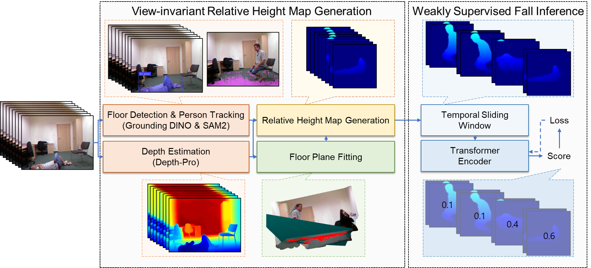

# Height-Map Fall Detection

This repository contains the paper-specific code for generating per-person relative height maps from RGB videos and training a weakly supervised fall detector on those height-map sequences.



The implementation is built around two upstream dependencies:

- `Grounded-SAM-2` for floor detection, segmentation, and person tracking
- `ml-depth-pro` for monocular depth estimation

## Quick Start

The shortest setup path is:

```bash
git clone https://github.com/Kijung-Kim/heightmap-fall-detection.git
cd heightmap-fall-detection
bash setup.sh
```

After that, prepare:

1. A local `Grounded-SAM-2` checkout
2. A local `ml-depth-pro` checkout
3. The required checkpoints
4. Your fall / non-fall RGB videos

Then check the available commands:

```bash
python scripts/generate_heightmaps.py --help
python scripts/train.py --help
```

## Repository Layout

```text
heightmap-fall-detection/
├── assets/
│   └── Figure_02.png
├── configs/
├── scripts/
│   ├── generate_heightmaps.py
│   └── train.py
├── src/heightmap_fall_detection/
│   ├── configs.py
│   ├── data.py
│   ├── losses.py
│   ├── metrics.py
│   ├── model.py
│   ├── preprocessing.py
│   └── train.py
├── pyproject.toml
├── requirements.txt
└── setup.sh
```

## What This Repository Includes

- Relative height-map generation from RGB videos
- Floor-plane estimation and person-wise crop export
- Per-track `64x64` height-map sequences
- Weakly supervised Transformer-based fall inference
- RFDS, URFD, and Le2i training presets

## What This Repository Does Not Include

- Large raw datasets
- Model checkpoints
- Full upstream `Grounded-SAM-2` source code
- Full upstream `ml-depth-pro` source code

## Installation

### Option 1: Recommended setup script

Run:

```bash
bash setup.sh
```

This script:

- creates `.venv`
- upgrades `pip`
- installs this repository in editable mode
- can optionally clone external repositories
- prints the remaining manual setup steps

To see optional flags:

```bash
bash setup.sh --help
```

### Option 2: Manual environment setup

```bash
python3 -m venv .venv
source .venv/bin/activate
pip install --upgrade pip
pip install -e .
```

## External Dependencies

The preprocessing pipeline requires local checkouts of:

- `Grounded-SAM-2`
- `ml-depth-pro`

Example:

```bash
git clone https://github.com/IDEA-Research/Grounded-SAM-2.git
git clone https://github.com/apple/ml-depth-pro.git
```

A clean workspace might look like this:

```text
workspace/
├── heightmap-fall-detection/
├── Grounded-SAM-2/
└── ml-depth-pro/
```

## Required Checkpoints

Before running preprocessing, you need local paths to:

- `depth_pro.pt`
- a SAM2 checkpoint such as `sam2.1_hiera_large.pt`

This repository does not auto-download checkpoints.

## End-to-End Pipeline

The full workflow is:

1. Prepare Python environment
2. Prepare `Grounded-SAM-2` and `ml-depth-pro`
3. Download checkpoints
4. Run height-map generation for `Fall`
5. Run height-map generation for `NonFall`
6. Train the fall detector

## Input Video Organization

Your raw videos can be stored in any layout. The preprocessing script recursively discovers video files under the given input path.

Example raw input:

```text
raw_videos/
├── RFDS/
│   ├── fall/
│   └── normal/
├── URFD/
│   ├── Fall/
│   └── ADL/
└── Le2i/
    ├── office/
    └── home/
```

## Generated Height-Map Dataset Format

The preprocessing script writes data in this structure:

```text
<output-root>/
├── Fall/
│   └── <video-name>/
│       └── track_<id>/
│           ├── 00000.npy
│           ├── 00001.npy
│           └── ...
└── NonFall/
    └── <video-name>/
        └── track_<id>/
            ├── 00000.npy
            ├── 00001.npy
            └── ...
```

This generated structure is the direct input to the training code.

## Height-Map Generation

Example for positive videos:

```bash
python scripts/generate_heightmaps.py \
  --input /path/to/RFDS/fall \
  --output-root ./datasets/rfds \
  --preview-root ./previews/rfds \
  --label Fall \
  --grounded-sam2-root /path/to/Grounded-SAM-2 \
  --depth-pro-root /path/to/ml-depth-pro \
  --depth-pro-checkpoint /path/to/ml-depth-pro/checkpoints/depth_pro.pt \
  --sam2-checkpoint /path/to/Grounded-SAM-2/checkpoints/sam2.1_hiera_large.pt \
  --tracking-device cuda:0 \
  --depth-device cuda:1
```

Example for negative videos:

```bash
python scripts/generate_heightmaps.py \
  --input /path/to/RFDS/normal \
  --output-root ./datasets/rfds \
  --preview-root ./previews/rfds \
  --label NonFall \
  --grounded-sam2-root /path/to/Grounded-SAM-2 \
  --depth-pro-root /path/to/ml-depth-pro \
  --depth-pro-checkpoint /path/to/ml-depth-pro/checkpoints/depth_pro.pt \
  --sam2-checkpoint /path/to/Grounded-SAM-2/checkpoints/sam2.1_hiera_large.pt \
  --tracking-device cuda:0 \
  --depth-device cuda:1
```

Notes:

- `--input` can be a single video file or a directory
- `--preview-root` is optional
- `--tracking-device` and `--depth-device` can target different GPUs

## Training

After generating height maps:

```bash
python scripts/train.py --config rfds --root-dir ./datasets/rfds
python scripts/train.py --config urfd --root-dir ./datasets/urfd
python scripts/train.py --config le2i --root-dir ./datasets/le2i
```

Each run writes:

- fold checkpoints
- `summary.json` with fold-wise and mean metrics

## Common Failure Points

- `ModuleNotFoundError`
  Activate `.venv` first.
- checkpoint path errors
  Verify `--depth-pro-checkpoint` and `--sam2-checkpoint`.
- CUDA errors
  Check `--tracking-device` and `--depth-device`.
- empty training dataset
  Verify the generated files follow `Fall/<video>/track_*/00000.npy`.

## Notes

- Keep this repository separate from your experimental `Grounded-SAM-2` workspace.
- Do not commit raw datasets, previews, or generated `.npy` outputs.
- This public repository is intended to contain code and documentation only.

## Citation

Add the paper citation here after release.
